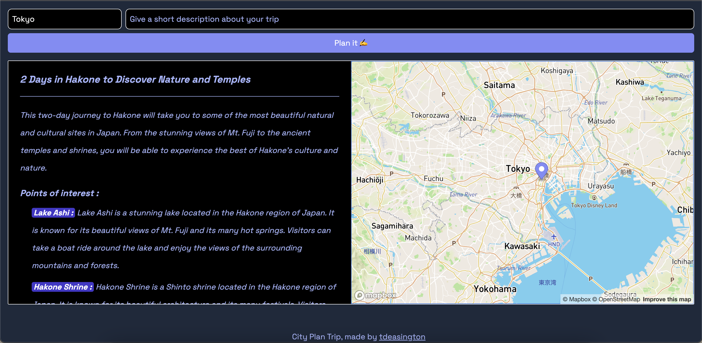

# City Plan Trip Project with Svelte, OpenAI and Mapbox

Inspired by Lichin Lin https://twitter.com/lichinlin/status/1631213239945277441?s=20



## Developing with Svelte

Once you've created a project and installed dependencies with `npm install` (or `pnpm install` or `yarn`), start a development server:

```bash
npm run dev
```

## Building with Svelte

To create a production version of your app:

```bash
npm run build
```

You can preview the production build with `npm run preview`.

> To deploy your app, you may need to install an [adapter](https://kit.svelte.dev/docs/adapters) for your target environment.
