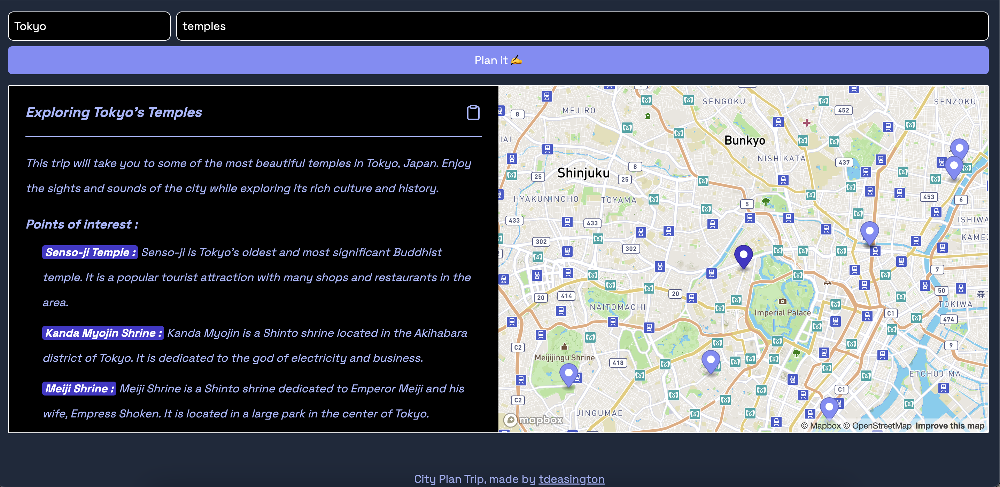

# City Plan Trip Project with Svelte, OpenAI and Mapbox

Inspired by Lichin Lin https://twitter.com/lichinlin/status/1631213239945277441?s=20



## Developing with Svelte

```bash
npm install
npm run dev
```

## Building with Svelte

To create a production version of the app:

```bash
npm run build
```

You can preview the production build with `npm run preview`.

To start the production version of the app:

```bash
node build
```
